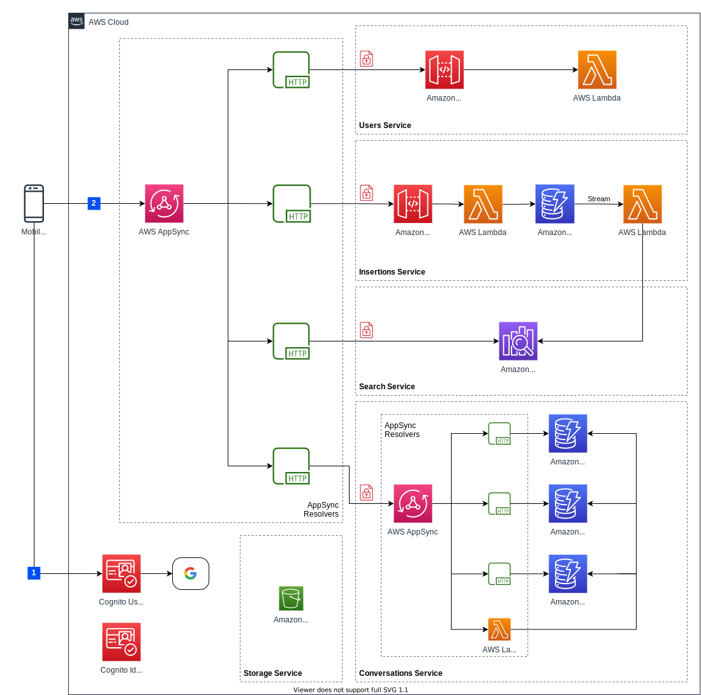

# PassIt! backend

`PassIt!` is a platform for helping *tutors* to post ads and for *students* to search a tutor.

## Infrastructure architecture


## Configuration
In order to build and deploy the backend on your AWS account you have to:

1. Configure on your machine your aws credentials
2. Setup on [Google developer console](https://console.developers.google.com) an android client and a web client following the instructions at [amplify social sign in section](https://docs.amplify.aws/lib/auth/social_signin_web_ui/q/platform/android#amazon-cognito-user-pool-setup)
3. Set the following environment variables (or put them inside an `.env` file on this project root folder):

  - `USER_POOL_DOMAIN_PREFIX=<user-pool-domain-prefix>`
  - `GOOGLE_ANDROID_CLIENT_ID=<your-google-android-client-id>`
  - `GOOGLE_WEB_CLIENT_ID=<your-google-app-id>`
  - `GOOGLE_WEB_CLIENT_SECRET=<your-google-app-secret>`

## Build
Install dependencies with:
```bash
yarn install
yarn run lerna bootstrap
```

Build the project with:

```bash
yarn run build
```

## Test

```bash
yarn run test
```

## Deploy

```bash
yarn run cdk:bootstrap
yarn run cdk:synth
yarn run deploy
```
