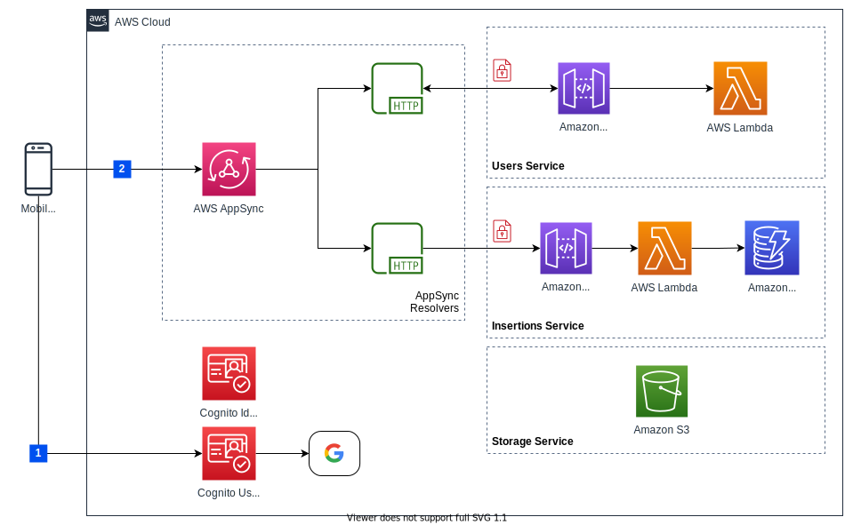

# PassIt! backend

`PassIt!` is a platform for helping *tutors* to post ads and for *students* to search a tutor.

## Infrastructure architecture


## Configuration
In order to build and deploy the backend on your AWS account you have to:

1. Configure on your machine your aws credentials. You can check out on the [Getting Started with CDK page](https://docs.aws.amazon.com/cdk/latest/guide/getting_started.html#getting_started_prerequisites) how to do it. When it instructs you to set the environment variables, add them to a (`.gitignore`d) `.env` file in the root folder of the project instead.
2. Setup a new Google Project on [Google developer console](https://console.developers.google.com/cloud-resource-manager).
3. Select the project created on previous step.
4. Configure on [Google developer console](https://console.developers.google.com) the OAuth consent screen:
   1. On the left navigation bar, choose *OAuth Consent Screen*.
   2. For *Authorized Domains* enter `amazoncognito.com`.
5. Setup on [Google developer console](https://console.developers.google.com) an android client:
   1. On the left navigation bar, choose Credentials.
   2. Create your OAuth2.0 credentials by choosing *OAuth client ID* from the *Create credentials* drop-down list.
   3. Choose Android application.
   4. On `package name` insert the android frontend application `package`.
   5. On the `SHA-1 digital certificate fingerprint` insert your keystore SHA-1 ([info](https://support.google.com/cloud/answer/6158849?authuser=1#installedapplications&android)).
6. Setup on [Google developer console](https://console.developers.google.com) a web client:
   1. On the left navigation bar, choose *Credentials*.
   2. Create your OAuth2.0 credentials by choosing *OAuth client ID* from the *Create credentials* drop-down list.
   3. Choose Web application.
   4. On *Authorized JavaScript origins* put your user pool domain, i.e. `https://<user-pool-domain-prefix>.auth.<aws-region>.amazoncognito.com` (any choosen value for `user-pool-domain-prefix` must be globally unique).
   5. On *Authorized Redirect URIs* put your user pool domain with the `/oauth2/idpresponse` endpoint, i.e. `https://<user-pool-domain-prefix>.auth.<aws-region>.amazoncognito.com/oauth2/idpresponse`.

7. Set the following environment variables (or put them inside an `.env` file on this project root folder) with values taken from previous steps:

  - `USER_POOL_DOMAIN_PREFIX=<your-user-pool-domain-prefix>`
  - `GOOGLE_ANDROID_CLIENT_ID=<your-google-android-client-id>`
  - `GOOGLE_WEB_CLIENT_ID=<your-google-web-client-id>`
  - `GOOGLE_WEB_CLIENT_SECRET=<your-google-web-client-secret>`

## Build
Install dependencies with:
```bash
yarn install
yarn run lerna bootstrap
```

Build the project with:

```bash
yarn run build
```

## Test

```
yarn run test
```

## Deploy

```bash
yarn run cdk bootstrap
yarn run cdk synth
yarn run deploy
```

Note: if you get an

```
Unable to resolve AWS account to use. It must be either configured when you define your CDK or through the environment
```

error when running `yarn run cdk bootstrap`, try to remove the `[profile default]` or `[default]` line from the beginning of your `~/.aws/config` file and run it again.

## Services
Back-end services are the following:

Service | Description
-------------------- | ------------------------------------------
[Auth](./packages/auth/README.md) | Authentication service.
[API](./packages/api/README.md) | API service.
[Users](./packages/users/README.md) | Provides User search.
[Insertions](./packages/insertions/README.md) | Provides CRUD operations on Insertions.
[Search](./packages/search/README.md) | Search service.
[Conversations](./packages/conversations/README.md) | Provides communication services between users.
[Storage](./packages/storage/README.md) | Storage service.
